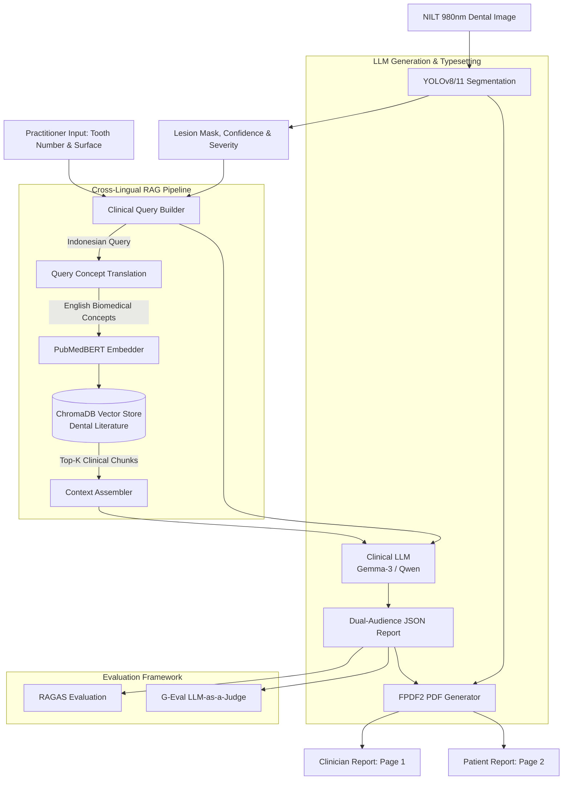

# TransAID: AI-Powered Clinical Decision Support System (CDSS) for Secondary Caries Detection

An end-to-end medical AI pipeline that couples **Computer Vision (YOLOv8/11 Instance Segmentation)** on **Near-Infrared Light Transillumination (NILT)** dental imagery with **Cross-Lingual Retrieval-Augmented Generation (RAG)** and **Clinical Large Language Models (LLMs)**.

The system analyzes transilluminated tooth images, segments caries lesions around existing restorations, retrieves evidence-based clinical literature from peer-reviewed dental journals, and synthesizes structured, publication-grade **dual-audience diagnostic reports** (clinician-facing and patient-facing).

---

## Key Features

- **Computer Vision (YOLOv8/11 Instance Segmentation)**: Detects and segments recurrent and residual caries margins on 980 nm NILT dental images.
- **Cross-Lingual RAG Pipeline**: Converts Indonesian clinical queries to domain-optimized English search concepts to query a PubMedBERT-embedded vector database of dental literature.
- **Biomedical Vector Store (ChromaDB)**: Curated knowledge base built from peer-reviewed dental publications (ICDAS, ICCMS, selective caries removal protocols).
- **Dual-Audience Report Generation**:
  - **Clinician-Facing**: Precise FDI tooth notation, radiometric interpretation, margin integrity assessment, and severity-tailored intervention pathways (active monitoring vs. bitewing confirmation vs. re-restoration / endodontics).
  - **Patient-Facing**: Accessible lay explanations in Indonesian, reassuring tone, and targeted daily brushing/flossing recommendations tailored to the exact tooth surface (occlusal, buccal, lingual, interproximal).
- **Automated PDF Typesetting**: Produces professional two-page clinical reports with side-by-side original and segmented lesion overlays.
- **Rigorous Offline Evaluation**: Built-in reference-free evaluation suites using **RAGAS** (Faithfulness, Relevancy, Precision, Recall) and **G-Eval LLM-as-a-Judge** (Coherence, Completeness, Relevance, Simplicity, Clarity).
- **Embedded Hardware Benchmarking**: Benchmark scripts comparing ONNX Runtime against TensorRT FP16 on NVIDIA Jetson edge devices.

---

## System Architecture



---

## Directory Structure

```
src/
├── cdss/                           # Clinical Decision Support System & RAG
│   ├── build_kb.py                 # PDF literature extractor, chunker & ChromaDB builder
│   ├── report.py                   # End-to-end CDSS inference & PDF generator
│   ├── geval.py                    # G-Eval reference-free LLM-as-a-judge evaluation
│   ├── ragas.py                    # RAGAS-inspired reference-free evaluation suite
│   └── knowledge_base/             # Peer-reviewed dental journal literature (PDFs)
├── yolo/                           # Computer Vision Model Training
│   └── train.py                    # YOLO instance segmentation training script
└── deployment/                     # Embedded Edge Deployment & Benchmarking
    └── jetson_inference.py         # Jetson Nano/Xavier/Orin ONNX vs. TensorRT benchmark
```

---

## Requirements & Environment Setup

### 1. Prerequisites
- Python 3.10 or higher
- NVIDIA GPU with CUDA support (recommended for YOLO training & local LLM inference)
- [Ollama](https://ollama.ai/) installed and running locally

### 2. Install Python Dependencies

```bash
pip install ultralytics torch torchvision torchaudio \
    chromadb sentence-transformers nltk pypdf fpdf2 \
    openai pillow requests numpy
```

### 3. Pull Ollama LLM Models

The pipeline uses `gemma3:12b` for clinical report generation and `qwen3:14b` for reference-free LLM judging:

```bash
ollama pull gemma3:12b
ollama pull qwen3:14b
```

### 4. Configure Environment Variables

Copy `.env.example` in the project root to `.env` and adjust paths as needed:

```bash
cp .env.example .env
```

| Variable | Default | Description |
| :--- | :--- | :--- |
| `YOLO_MODEL_PATH` | `src/yolo/weights/best.pt` | Path to trained YOLO instance segmentation weights |
| `DATA_YAML` | `src/yolo/data.yaml` | Dataset YAML configuration for training |
| `CHROMA_PATH` | `src/cdss/chroma_db` | Storage path for ChromaDB vector database |
| `JOURNALS_FOLDER` | `src/cdss/knowledge_base` | Directory containing dental journal PDFs |
| `COLLECTION_NAME` | `karies_knowledge` | ChromaDB collection name |
| `OLLAMA_BASE_URL` | `http://localhost:11434` | Ollama HTTP endpoint |
| `LLM_MODEL` | `gemma3:12b` | Clinical generation LLM |
| `JUDGE_MODEL` | `qwen3:14b` | Evaluation LLM for G-Eval and RAGAS |
| `CDSS_OUTPUT_DIR` | `src/cdss/outputs/reports` | Output directory for generated PDF and JSON reports |
| `GEVAL_OUTPUT_DIR` | `src/cdss/outputs/geval` | Output directory for G-Eval evaluation scores |
| `RAGAS_OUTPUT_DIR` | `src/cdss/outputs/ragas` | Output directory for RAGAS evaluation scores |

---

## Workflow & Usage Guide

### Step 1: Train YOLO Segmentation Model (Optional)

To train or fine-tune YOLO instance segmentation on NILT images:

```bash
python src/yolo/train.py
```

- Hyperparameters are tuned for transillumination dental photography: AdamW optimizer, cosine annealing schedule, and mosaic/mixup augmentations.
- Checkpoints, plots, and validation metrics are saved to `runs/exp_yolov8s_caries`.

### Step 2: Build the ChromaDB Knowledge Base

Extract, chunk, and index dental literature PDFs into the vector store:

```bash
python src/cdss/build_kb.py
```

- Strips academic bibliographies and reference sections.
- Applies sentence-aware sliding window chunking (target: 150 words, overlap: 30 words) with NLTK.
- Encodes passages into 768-dimensional biomedical vector embeddings via `NeuML/pubmedbert-base-embeddings`.

### Step 3: Run the CDSS Reporting Pipeline

Run the end-to-end pipeline on an input NILT dental image:

```bash
python src/cdss/report.py path/to/nilt_image.jpg
```

**Interactive Prompts:**
1. Enter the tooth number in FDI notation (e.g., `36`, `15`, `46`).
2. Enter the lesion location / surface (e.g., `oklusal`, `mesial`, `distal`, `bukal`, `servikal`).

**Output:**
- Side-by-side segmentation visualization (`yolo_result.jpg`).
- Structured multi-page clinical PDF report (`laporan_<timestamp>.pdf`).
- Evaluation sidecar JSON (`laporan_<timestamp>.json`).

#### Batch Healthy Control Cases:
To generate reports for healthy control cases (cases with no detected caries):

```bash
python src/cdss/report.py --healthy
```

### Step 4: Quality Evaluation (RAGAS & G-Eval)

Evaluate all generated reports stored in the output folder:

#### RAGAS Metric Suite:
Evaluates clinician reports against four reference-free dimensions:
- **Faithfulness**: Verifies claims against literature or established dental knowledge.
- **Answer Relevancy**: Checks coverage of tooth, surface, and severity.
- **Context Precision**: Rates the clinical usefulness of retrieved literature.
- **Context Recall**: Verifies whether essential clinical concepts were retrieved.

```bash
python src/cdss/ragas.py
```

#### G-Eval LLM-as-a-Judge Suite:
Evaluates both clinician and patient reports using chain-of-thought rubrics:
- **Dentist Report**: Coherence, Completeness, Relevance, Fluency (1–5 scale).
- **Patient Report**: Simplicity, Clarity, Fluency, Conciseness (1–5 scale).

```bash
python src/cdss/geval.py
```

Results are saved as individual JSON sidecars (`<report_id>_geval.json`) and aggregated into `geval_scores.csv`.

### Step 5: Hardware Benchmarking on NVIDIA Jetson

To benchmark inference speed on embedded NVIDIA Jetson platforms:

```bash
python src/deployment/jetson_inference.py --mode both --image-dir path/to/images/
```

- Compares **ONNX Runtime** (CPU/CUDA) vs. **TensorRT FP16** engine.
- Records mean/median/std latency, FPS, and 95th-percentile metrics alongside tegrastats device telemetry into CSV format.

---

## Clinical Report Structure

### Page 1: Clinician Report (`Laporan Dokter`)
- **Examination Metadata**: Date, unique report number, patient ID, tooth FDI number, detected class, detection confidence, and severity level.
- **Side-by-Side Imagery**: Original NILT image alongside the YOLO instance segmentation mask overlay.
- **Temuan (Findings)**: Direct radiometrical statement of detected lesion.
- **Interpretasi (Interpretation)**: Diagnostic assessment of marginal integrity and probable dentin/pulpal involvement.
- **Rekomendasi (Recommendations)**: Concrete, severity-stratified next steps:
  - *Low (<50%)*: Active monitoring and clinical re-evaluation on next recall.
  - *Moderate (50–75%)*: Bitewing radiography confirmation to assess lesion depth and margin leakage; consider total-etch/self-etch re-restoration.
  - *High (>75%)*: Indication for restoration replacement or endodontic intervention; periapical radiograph for pulpal involvement.

### Page 2: Patient Report (`Laporan Pasien`)
- **Apa yang ditemukan? (Summary)**: Clear explanation in Indonesian avoiding technical dental jargon; introduces secondary caries simply as *"kerusakan gigi baru yang muncul di sekitar tambalan yang sudah ada"*.
- **Apa yang perlu dilakukan? (Action Plan)**: Visit urgency and home care advice customized to the tooth surface:
  - *Interproximal (mesial/distal)*: Daily dental flossing.
  - *Occlusal*: Thorough brushing of biting surfaces.
  - *Cervical*: Gentle circular brushing at the gumline.

---

## Citation & Reference Literature

The knowledge base leverages consensus guidelines and peer-reviewed dental literature, including:
- **ICCMS™**: International Caries Classification and Management System guidelines.
- **ICDAS**: International Caries Detection and Assessment System criteria manual.
- Consensus statements on management of secondary and residual caries around composite restorations.
